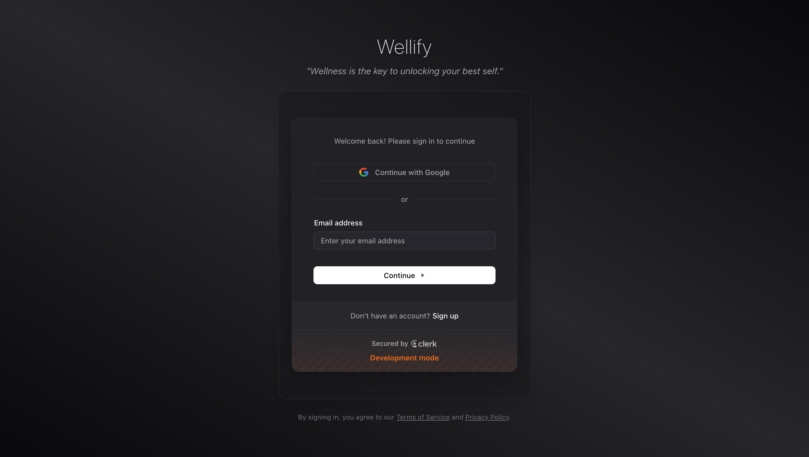

# 🌟 Wellify

> **Your Personal Health & Wellness Companion**

Wellify is a comprehensive health and wellness application built with Next.js that combines AI-powered coaching, posture analysis, habit tracking, and social features to help you achieve your wellness goals.

---

## 🚀 Features

### 🤖 AI-Powered Health Coach
Get personalized health advice and coaching powered by advanced AI algorithms.

### 📊 Comprehensive Dashboard
Track your progress with detailed analytics and insights into your health journey.

### 🏆 Gamified Wellness Experience
Stay motivated with quests, achievements, and leaderboards.

  
  

### 🧘 Mindfulness & Breathing
Integrated breathing exercises and mindfulness activities to reduce stress and improve mental health.

### 📱 Social Feed
Connect with like-minded individuals, share your progress, and get motivated by the community.

### 🔒 Secure Authentication
Secure login and user management powered by Clerk.

### 📅 Smart Reminders
Never miss your wellness activities with intelligent reminder system.

### 🎯 Posture & Movement Analysis
AI-powered posture analysis using MediaPipe technology to help improve your physical well-being.

  
  

---

## 🛠️ Tech Stack

- **Framework:** Next.js 15.5.2 with Turbopack
- **Authentication:** Clerk
- **Database:** Neon PostgreSQL with Drizzle ORM
- **AI/ML:** MediaPipe for computer vision, Face-API.js
- **UI/UX:** Tailwind CSS, Radix UI, Framer Motion
- **Charts:** Recharts
- **Camera:** React Webcam
- **State Management:** Jotai
- **Icons:** Lucide React, React Icons

## 🌟 Key Features Deep Dive

### AI Health Coaching
- Personalized health recommendations
- Real-time feedback and suggestions
- Progress tracking and analysis

### Computer Vision Integration
- Real-time posture analysis using MediaPipe
- Face mesh detection for wellness insights
- Camera-based movement tracking

### Gamification Elements
- Achievement system
- Progress quests
- Community leaderboards
- Social sharing capabilities

### Data Analytics
- Comprehensive health metrics
- Visual progress charts
- Trend analysis
- Export capabilities

---

## 🔧 Configuration

The application uses several external services that require configuration:

- **Clerk** - User authentication and management
- **Neon** - PostgreSQL database hosting
- **MediaPipe** - AI/ML computer vision tasks

Make sure to set up your `.env.local` file with the appropriate API keys and configuration values.

---

## 📚 Learning Resources

To learn more about the technologies used in this project:

- [Next.js Documentation](https://nextjs.org/docs) - Learn about Next.js features and API
- [Clerk Documentation](https://clerk.com/docs) - Authentication and user management
- [MediaPipe](https://mediapipe.dev/) - ML solutions for live and streaming media
- [Tailwind CSS](https://tailwindcss.com/docs) - Utility-first CSS framework
- [Drizzle ORM](https://orm.drizzle.team/) - TypeScript ORM

---

  <strong>Built with ❤️ for a healthier tomorrow</strong>

